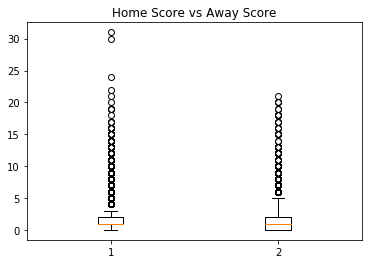
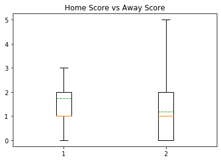
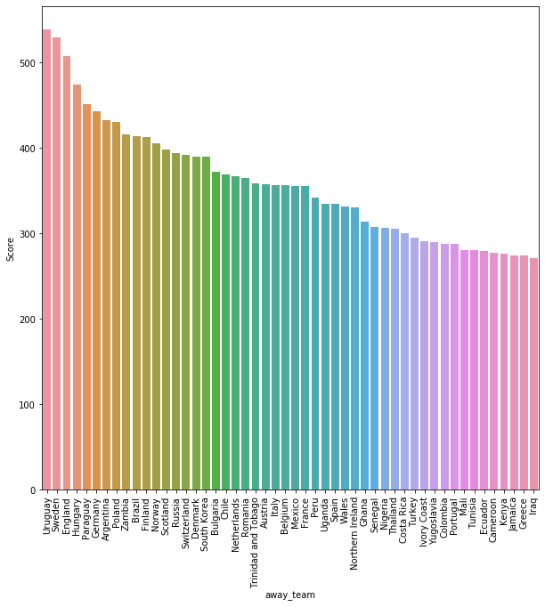
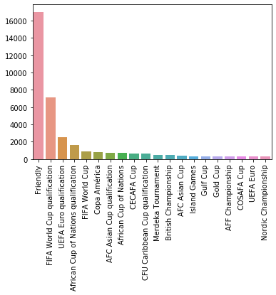
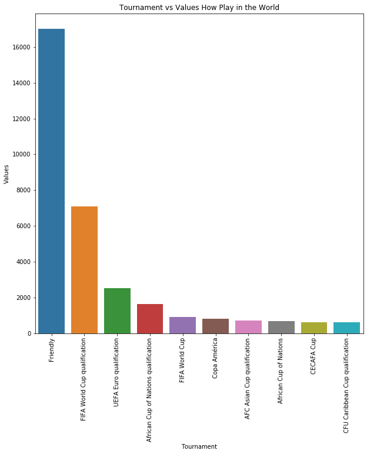
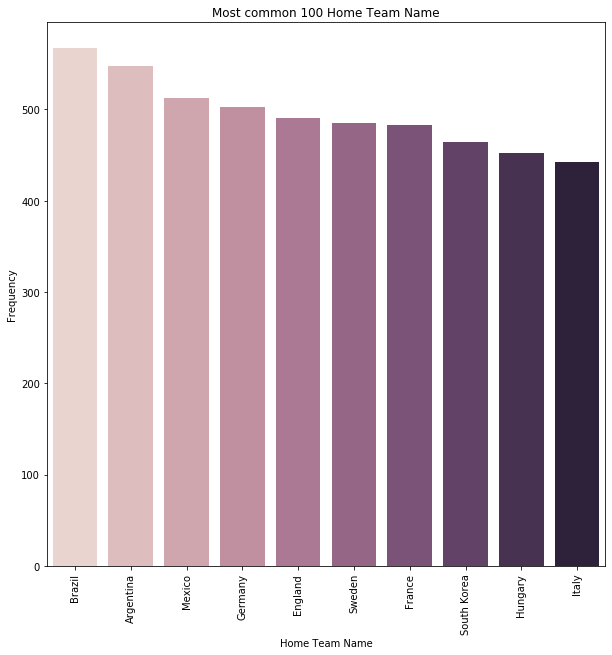

```python
import pandas as pd
import matplotlib.pyplot as plt
import numpy as np
import seaborn as sns
from scipy.stats import poisson,skellam
results = pd.read_csv('/Users/aldiyar/Desktop/python app1/ml/Untitled Folder/results.csv')
```


```python
results.head(5)
```


<div>
<style scoped>
    .dataframe tbody tr th:only-of-type {
        vertical-align: middle;
    }

    .dataframe tbody tr th {
        vertical-align: top;
    }

    .dataframe thead th {
        text-align: right;
    }
</style>
<table border="1" class="dataframe">
  <thead>
    <tr style="text-align: right;">
      <th></th>
      <th>date</th>
      <th>home_team</th>
      <th>away_team</th>
      <th>home_score</th>
      <th>away_score</th>
      <th>tournament</th>
      <th>city</th>
      <th>country</th>
      <th>neutral</th>
    </tr>
  </thead>
  <tbody>
    <tr>
      <td>0</td>
      <td>1872-11-30</td>
      <td>Scotland</td>
      <td>England</td>
      <td>0</td>
      <td>0</td>
      <td>Friendly</td>
      <td>Glasgow</td>
      <td>Scotland</td>
      <td>False</td>
    </tr>
    <tr>
      <td>1</td>
      <td>1873-03-08</td>
      <td>England</td>
      <td>Scotland</td>
      <td>4</td>
      <td>2</td>
      <td>Friendly</td>
      <td>London</td>
      <td>England</td>
      <td>False</td>
    </tr>
    <tr>
      <td>2</td>
      <td>1874-03-07</td>
      <td>Scotland</td>
      <td>England</td>
      <td>2</td>
      <td>1</td>
      <td>Friendly</td>
      <td>Glasgow</td>
      <td>Scotland</td>
      <td>False</td>
    </tr>
    <tr>
      <td>3</td>
      <td>1875-03-06</td>
      <td>England</td>
      <td>Scotland</td>
      <td>2</td>
      <td>2</td>
      <td>Friendly</td>
      <td>London</td>
      <td>England</td>
      <td>False</td>
    </tr>
    <tr>
      <td>4</td>
      <td>1876-03-04</td>
      <td>Scotland</td>
      <td>England</td>
      <td>3</td>
      <td>0</td>
      <td>Friendly</td>
      <td>Glasgow</td>
      <td>Scotland</td>
      <td>False</td>
    </tr>
  </tbody>
</table>
</div>


```python
# New date variables
results['date'] = pd.to_datetime(results['date'])
results['date1_year'] = results['date'].dt.year
results['date2_month'] = results['date'].dt.month
results['date3_day'] = results['date'].dt.day
# Total score is used to compute average score by game
results['total_score'] = results.home_score + results.away_score  
results['diff_score'] = abs(results.home_score - results.away_score)

results.head(5)
```


<div>
<style scoped>
    .dataframe tbody tr th:only-of-type {
        vertical-align: middle;
    }

    .dataframe tbody tr th {
        vertical-align: top;
    }

    .dataframe thead th {
        text-align: right;
    }
</style>
<table border="1" class="dataframe">
  <thead>
    <tr style="text-align: right;">
      <th></th>
      <th>date</th>
      <th>home_team</th>
      <th>away_team</th>
      <th>home_score</th>
      <th>away_score</th>
      <th>tournament</th>
      <th>city</th>
      <th>country</th>
      <th>neutral</th>
      <th>date1_year</th>
      <th>date2_month</th>
      <th>date3_day</th>
      <th>total_score</th>
      <th>diff_score</th>
    </tr>
  </thead>
  <tbody>
    <tr>
      <td>0</td>
      <td>1872-11-30</td>
      <td>Scotland</td>
      <td>England</td>
      <td>0</td>
      <td>0</td>
      <td>Friendly</td>
      <td>Glasgow</td>
      <td>Scotland</td>
      <td>False</td>
      <td>1872</td>
      <td>11</td>
      <td>30</td>
      <td>0</td>
      <td>0</td>
    </tr>
    <tr>
      <td>1</td>
      <td>1873-03-08</td>
      <td>England</td>
      <td>Scotland</td>
      <td>4</td>
      <td>2</td>
      <td>Friendly</td>
      <td>London</td>
      <td>England</td>
      <td>False</td>
      <td>1873</td>
      <td>3</td>
      <td>8</td>
      <td>6</td>
      <td>2</td>
    </tr>
    <tr>
      <td>2</td>
      <td>1874-03-07</td>
      <td>Scotland</td>
      <td>England</td>
      <td>2</td>
      <td>1</td>
      <td>Friendly</td>
      <td>Glasgow</td>
      <td>Scotland</td>
      <td>False</td>
      <td>1874</td>
      <td>3</td>
      <td>7</td>
      <td>3</td>
      <td>1</td>
    </tr>
    <tr>
      <td>3</td>
      <td>1875-03-06</td>
      <td>England</td>
      <td>Scotland</td>
      <td>2</td>
      <td>2</td>
      <td>Friendly</td>
      <td>London</td>
      <td>England</td>
      <td>False</td>
      <td>1875</td>
      <td>3</td>
      <td>6</td>
      <td>4</td>
      <td>0</td>
    </tr>
    <tr>
      <td>4</td>
      <td>1876-03-04</td>
      <td>Scotland</td>
      <td>England</td>
      <td>3</td>
      <td>0</td>
      <td>Friendly</td>
      <td>Glasgow</td>
      <td>Scotland</td>
      <td>False</td>
      <td>1876</td>
      <td>3</td>
      <td>4</td>
      <td>3</td>
      <td>3</td>
    </tr>
  </tbody>
</table>
</div>


```python
results.tail(5)
```


<div>
<style scoped>
    .dataframe tbody tr th:only-of-type {
        vertical-align: middle;
    }

    .dataframe tbody tr th {
        vertical-align: top;
    }

    .dataframe thead th {
        text-align: right;
    }
</style>
<table border="1" class="dataframe">
  <thead>
    <tr style="text-align: right;">
      <th></th>
      <th>date</th>
      <th>home_team</th>
      <th>away_team</th>
      <th>home_score</th>
      <th>away_score</th>
      <th>tournament</th>
      <th>city</th>
      <th>country</th>
      <th>neutral</th>
      <th>date1_year</th>
      <th>date2_month</th>
      <th>date3_day</th>
      <th>total_score</th>
      <th>diff_score</th>
    </tr>
  </thead>
  <tbody>
    <tr>
      <td>41238</td>
      <td>2019-10-20</td>
      <td>Lesotho</td>
      <td>Zimbabwe</td>
      <td>0</td>
      <td>0</td>
      <td>African Nations Championship qualifying</td>
      <td>Lesotho</td>
      <td>Lesotho</td>
      <td>False</td>
      <td>2019</td>
      <td>10</td>
      <td>20</td>
      <td>0</td>
      <td>0</td>
    </tr>
    <tr>
      <td>41239</td>
      <td>2019-10-20</td>
      <td>Guinea</td>
      <td>Senegal</td>
      <td>1</td>
      <td>0</td>
      <td>African Nations Championship qualifying</td>
      <td>Conakry</td>
      <td>Guinea</td>
      <td>False</td>
      <td>2019</td>
      <td>10</td>
      <td>20</td>
      <td>1</td>
      <td>1</td>
    </tr>
    <tr>
      <td>41240</td>
      <td>2019-10-20</td>
      <td>Mali</td>
      <td>Mauritania</td>
      <td>2</td>
      <td>0</td>
      <td>African Nations Championship qualifying</td>
      <td>Mali</td>
      <td>Mali</td>
      <td>False</td>
      <td>2019</td>
      <td>10</td>
      <td>20</td>
      <td>2</td>
      <td>2</td>
    </tr>
    <tr>
      <td>41241</td>
      <td>2019-10-20</td>
      <td>Burkina Faso</td>
      <td>Ghana</td>
      <td>0</td>
      <td>0</td>
      <td>African Nations Championship qualifying</td>
      <td>Burkina Faso</td>
      <td>Burkina Faso</td>
      <td>False</td>
      <td>2019</td>
      <td>10</td>
      <td>20</td>
      <td>0</td>
      <td>0</td>
    </tr>
    <tr>
      <td>41242</td>
      <td>2019-10-20</td>
      <td>Ivory Coast</td>
      <td>Niger</td>
      <td>1</td>
      <td>0</td>
      <td>African Nations Championship qualifying</td>
      <td>Ivory Coast</td>
      <td>Ivory Coast</td>
      <td>False</td>
      <td>2019</td>
      <td>10</td>
      <td>20</td>
      <td>1</td>
      <td>1</td>
    </tr>
  </tbody>
</table>
</div>


```python
results.dtypes
```


    date          object
    home_team     object
    away_team     object
    home_score     int64
    away_score     int64
    tournament    object
    city          object
    country       object
    neutral         bool
    dtype: object


```python
results[['home_score']].describe()
```


<div>
<style scoped>
    .dataframe tbody tr th:only-of-type {
        vertical-align: middle;
    }

    .dataframe tbody tr th {
        vertical-align: top;
    }

    .dataframe thead th {
        text-align: right;
    }
</style>
<table border="1" class="dataframe">
  <thead>
    <tr style="text-align: right;">
      <th></th>
      <th>home_score</th>
    </tr>
  </thead>
  <tbody>
    <tr>
      <td>count</td>
      <td>41243.000000</td>
    </tr>
    <tr>
      <td>mean</td>
      <td>1.744975</td>
    </tr>
    <tr>
      <td>std</td>
      <td>1.750513</td>
    </tr>
    <tr>
      <td>min</td>
      <td>0.000000</td>
    </tr>
    <tr>
      <td>25%</td>
      <td>1.000000</td>
    </tr>
    <tr>
      <td>50%</td>
      <td>1.000000</td>
    </tr>
    <tr>
      <td>75%</td>
      <td>2.000000</td>
    </tr>
    <tr>
      <td>max</td>
      <td>31.000000</td>
    </tr>
  </tbody>
</table>
</div>


```python
results[['away_score']].describe()
```


<div>
<style scoped>
    .dataframe tbody tr th:only-of-type {
        vertical-align: middle;
    }

    .dataframe tbody tr th {
        vertical-align: top;
    }

    .dataframe thead th {
        text-align: right;
    }
</style>
<table border="1" class="dataframe">
  <thead>
    <tr style="text-align: right;">
      <th></th>
      <th>away_score</th>
    </tr>
  </thead>
  <tbody>
    <tr>
      <td>count</td>
      <td>41243.000000</td>
    </tr>
    <tr>
      <td>mean</td>
      <td>1.189317</td>
    </tr>
    <tr>
      <td>std</td>
      <td>1.406648</td>
    </tr>
    <tr>
      <td>min</td>
      <td>0.000000</td>
    </tr>
    <tr>
      <td>25%</td>
      <td>0.000000</td>
    </tr>
    <tr>
      <td>50%</td>
      <td>1.000000</td>
    </tr>
    <tr>
      <td>75%</td>
      <td>2.000000</td>
    </tr>
    <tr>
      <td>max</td>
      <td>21.000000</td>
    </tr>
  </tbody>
</table>
</div>


```python
hs = results["home_score"]
aws = results["away_score"]
data = [hs, aws]
fig1, ax1 = plt.subplots()
ax7.set_title('Home Score vs Away Score')
ax7.boxplot(data)

plt.show()
```





```python
data = [hs, aws]
fig2, ax2 = plt.subplots()
ax2.set_title('Home Score vs Away Score')
ax2.boxplot(data, showfliers=False, meanline= True, showmeans= True)
plt.show()
```





```python
joint=pd.concat([hs, aws], axis=1)
```


```python
with sns.axes_style('white'): 
    sns.jointplot("home_score", "away_score", joint, kind='kde')
```


```python
away_team=pd.DataFrame(results.groupby('away_team')['home_score'].count().index)
away_score=pd.DataFrame(results.groupby('away_team')['home_score'].count().values,columns=['Score'])
away_score_team=pd.concat([away_team,away_score],axis=1)


plt.figure(figsize=(10,10))
away_score_team=away_score_team.sort_values(by='Score',ascending=False)
sns.barplot(x=away_score_team.away_team[:50],y=away_score_team.Score[:50])
plt.xticks(rotation=90)
plt.show()
```





```python
results['tournament'].value_counts()
```


    Friendly                                17011
    FIFA World Cup qualification             7100
    UEFA Euro qualification                  2532
    African Cup of Nations qualification     1624
    FIFA World Cup                            900
                                            ...  
    Dragon Cup                                  4
    OSN Cup                                     4
    AFF Championship qualification              2
    Copa América qualification                  2
    Atlantic Heritage Cup                       2
    Name: tournament, Length: 112, dtype: int64


```python
sns.barplot(x=results['tournament'].value_counts().index[:20],y=results['tournament'].value_counts().values[:20])
plt.xticks(rotation=90)
plt.show()

```





Fascinating, UEFA Euro is the most prestigious tournament and arguably the hardest to win, yet the world only saw 280 games played. The last EURO 2018 was generated ad revenue of  USD 2.13B  for 51 games thus USD 41M per game on average. Whilst the EPL generates on average USD6B per year for a total of 380 games, thus generating only USD16M per game on average. It totally makes sense that UEFA expanded the number of teams that can participate in order to boost the revenue in the expense of quality of games.Although there is no clear data on friendly games for a good reason. It is reported the state-owned first channel in Russia generated up to USD 5M per game after the World Cup. Obviously, I cannot take this value as representing the situation, but even a mere USD 100k will bost friendlies revenue north of a hundred millions dollars. 


```python
tournament=results['tournament'].value_counts()
names=tournament.index
values=tournament.values

plt.figure(figsize=(10,10))
sns.barplot(x=names[:10],y=values[:10])
plt.xticks(rotation=90)
plt.ylabel('Values')
plt.xlabel('Tournament')
plt.title('Tournament vs Values How Play in the World')
plt.show()
```





```python
home_name_index=results.home_team.value_counts()
home_name_index=home_name_index.head(10)

plt.figure(figsize=(10,10))
ax=sns.barplot(x=home_name_index.index,y=home_name_index.values,palette=sns.cubehelix_palette(len(home_name_index.index)))
plt.xlabel('Home Team Name')
plt.ylabel('Frequency')
plt.xticks(rotation=90)
plt.title('Most common 100 Home Team Name')
plt.show()
```





```python
RU=results[results['tournament']=='FIFA World Cup'].tail(64)
```


```python
BR1 = results[results['tournament']=='FIFA World Cup']
BR = BR1[BR1['country']=='Brazil'].tail(64)
BR
```


<div>
<style scoped>
    .dataframe tbody tr th:only-of-type {
        vertical-align: middle;
    }

    .dataframe tbody tr th {
        vertical-align: top;
    }

    .dataframe thead th {
        text-align: right;
    }
</style>
<table border="1" class="dataframe">
  <thead>
    <tr style="text-align: right;">
      <th></th>
      <th>date</th>
      <th>home_team</th>
      <th>away_team</th>
      <th>home_score</th>
      <th>away_score</th>
      <th>tournament</th>
      <th>city</th>
      <th>country</th>
      <th>neutral</th>
      <th>date1_year</th>
      <th>date2_month</th>
      <th>date3_day</th>
      <th>total_score</th>
      <th>diff_score</th>
    </tr>
  </thead>
  <tbody>
    <tr>
      <td>36065</td>
      <td>2014-06-12</td>
      <td>Brazil</td>
      <td>Croatia</td>
      <td>3</td>
      <td>1</td>
      <td>FIFA World Cup</td>
      <td>São Paulo</td>
      <td>Brazil</td>
      <td>False</td>
      <td>2014</td>
      <td>6</td>
      <td>12</td>
      <td>4</td>
      <td>2</td>
    </tr>
    <tr>
      <td>36066</td>
      <td>2014-06-13</td>
      <td>Chile</td>
      <td>Australia</td>
      <td>3</td>
      <td>1</td>
      <td>FIFA World Cup</td>
      <td>Cuiabá</td>
      <td>Brazil</td>
      <td>True</td>
      <td>2014</td>
      <td>6</td>
      <td>13</td>
      <td>4</td>
      <td>2</td>
    </tr>
    <tr>
      <td>36067</td>
      <td>2014-06-13</td>
      <td>Mexico</td>
      <td>Cameroon</td>
      <td>1</td>
      <td>0</td>
      <td>FIFA World Cup</td>
      <td>Natal</td>
      <td>Brazil</td>
      <td>True</td>
      <td>2014</td>
      <td>6</td>
      <td>13</td>
      <td>1</td>
      <td>1</td>
    </tr>
    <tr>
      <td>36068</td>
      <td>2014-06-13</td>
      <td>Spain</td>
      <td>Netherlands</td>
      <td>1</td>
      <td>5</td>
      <td>FIFA World Cup</td>
      <td>Salvador</td>
      <td>Brazil</td>
      <td>True</td>
      <td>2014</td>
      <td>6</td>
      <td>13</td>
      <td>6</td>
      <td>4</td>
    </tr>
    <tr>
      <td>36069</td>
      <td>2014-06-14</td>
      <td>Colombia</td>
      <td>Greece</td>
      <td>3</td>
      <td>0</td>
      <td>FIFA World Cup</td>
      <td>Belo Horizonte</td>
      <td>Brazil</td>
      <td>True</td>
      <td>2014</td>
      <td>6</td>
      <td>14</td>
      <td>3</td>
      <td>3</td>
    </tr>
    <tr>
      <td>...</td>
      <td>...</td>
      <td>...</td>
      <td>...</td>
      <td>...</td>
      <td>...</td>
      <td>...</td>
      <td>...</td>
      <td>...</td>
      <td>...</td>
      <td>...</td>
      <td>...</td>
      <td>...</td>
      <td>...</td>
      <td>...</td>
    </tr>
    <tr>
      <td>36130</td>
      <td>2014-07-05</td>
      <td>Netherlands</td>
      <td>Costa Rica</td>
      <td>0</td>
      <td>0</td>
      <td>FIFA World Cup</td>
      <td>Salvador</td>
      <td>Brazil</td>
      <td>True</td>
      <td>2014</td>
      <td>7</td>
      <td>5</td>
      <td>0</td>
      <td>0</td>
    </tr>
    <tr>
      <td>36132</td>
      <td>2014-07-08</td>
      <td>Brazil</td>
      <td>Germany</td>
      <td>1</td>
      <td>7</td>
      <td>FIFA World Cup</td>
      <td>Belo Horizonte</td>
      <td>Brazil</td>
      <td>False</td>
      <td>2014</td>
      <td>7</td>
      <td>8</td>
      <td>8</td>
      <td>6</td>
    </tr>
    <tr>
      <td>36133</td>
      <td>2014-07-09</td>
      <td>Netherlands</td>
      <td>Argentina</td>
      <td>0</td>
      <td>0</td>
      <td>FIFA World Cup</td>
      <td>São Paulo</td>
      <td>Brazil</td>
      <td>True</td>
      <td>2014</td>
      <td>7</td>
      <td>9</td>
      <td>0</td>
      <td>0</td>
    </tr>
    <tr>
      <td>36135</td>
      <td>2014-07-12</td>
      <td>Brazil</td>
      <td>Netherlands</td>
      <td>0</td>
      <td>3</td>
      <td>FIFA World Cup</td>
      <td>Brasília</td>
      <td>Brazil</td>
      <td>False</td>
      <td>2014</td>
      <td>7</td>
      <td>12</td>
      <td>3</td>
      <td>3</td>
    </tr>
    <tr>
      <td>36137</td>
      <td>2014-07-13</td>
      <td>Germany</td>
      <td>Argentina</td>
      <td>1</td>
      <td>0</td>
      <td>FIFA World Cup</td>
      <td>Rio de Janeiro</td>
      <td>Brazil</td>
      <td>True</td>
      <td>2014</td>
      <td>7</td>
      <td>13</td>
      <td>1</td>
      <td>1</td>
    </tr>
  </tbody>
</table>
<p>64 rows × 14 columns</p>
</div>


```python
SA = BR1[BR1['country']=='South Africa']
SA
```


<div>
<style scoped>
    .dataframe tbody tr th:only-of-type {
        vertical-align: middle;
    }

    .dataframe tbody tr th {
        vertical-align: top;
    }

    .dataframe thead th {
        text-align: right;
    }
</style>
<table border="1" class="dataframe">
  <thead>
    <tr style="text-align: right;">
      <th></th>
      <th>date</th>
      <th>home_team</th>
      <th>away_team</th>
      <th>home_score</th>
      <th>away_score</th>
      <th>tournament</th>
      <th>city</th>
      <th>country</th>
      <th>neutral</th>
      <th>date1_year</th>
      <th>date2_month</th>
      <th>date3_day</th>
      <th>total_score</th>
      <th>diff_score</th>
    </tr>
  </thead>
  <tbody>
    <tr>
      <td>32109</td>
      <td>2010-06-11</td>
      <td>South Africa</td>
      <td>Mexico</td>
      <td>1</td>
      <td>1</td>
      <td>FIFA World Cup</td>
      <td>Johannesburg</td>
      <td>South Africa</td>
      <td>False</td>
      <td>2010</td>
      <td>6</td>
      <td>11</td>
      <td>2</td>
      <td>0</td>
    </tr>
    <tr>
      <td>32110</td>
      <td>2010-06-11</td>
      <td>Uruguay</td>
      <td>France</td>
      <td>0</td>
      <td>0</td>
      <td>FIFA World Cup</td>
      <td>Cape Town</td>
      <td>South Africa</td>
      <td>True</td>
      <td>2010</td>
      <td>6</td>
      <td>11</td>
      <td>0</td>
      <td>0</td>
    </tr>
    <tr>
      <td>32111</td>
      <td>2010-06-12</td>
      <td>Argentina</td>
      <td>Nigeria</td>
      <td>1</td>
      <td>0</td>
      <td>FIFA World Cup</td>
      <td>Johannesburg</td>
      <td>South Africa</td>
      <td>True</td>
      <td>2010</td>
      <td>6</td>
      <td>12</td>
      <td>1</td>
      <td>1</td>
    </tr>
    <tr>
      <td>32112</td>
      <td>2010-06-12</td>
      <td>England</td>
      <td>United States</td>
      <td>1</td>
      <td>1</td>
      <td>FIFA World Cup</td>
      <td>Rustenburg</td>
      <td>South Africa</td>
      <td>True</td>
      <td>2010</td>
      <td>6</td>
      <td>12</td>
      <td>2</td>
      <td>0</td>
    </tr>
    <tr>
      <td>32113</td>
      <td>2010-06-12</td>
      <td>South Korea</td>
      <td>Greece</td>
      <td>2</td>
      <td>0</td>
      <td>FIFA World Cup</td>
      <td>Port Elizabeth</td>
      <td>South Africa</td>
      <td>True</td>
      <td>2010</td>
      <td>6</td>
      <td>12</td>
      <td>2</td>
      <td>2</td>
    </tr>
    <tr>
      <td>...</td>
      <td>...</td>
      <td>...</td>
      <td>...</td>
      <td>...</td>
      <td>...</td>
      <td>...</td>
      <td>...</td>
      <td>...</td>
      <td>...</td>
      <td>...</td>
      <td>...</td>
      <td>...</td>
      <td>...</td>
      <td>...</td>
    </tr>
    <tr>
      <td>32177</td>
      <td>2010-07-03</td>
      <td>Paraguay</td>
      <td>Spain</td>
      <td>0</td>
      <td>1</td>
      <td>FIFA World Cup</td>
      <td>Johannesburg</td>
      <td>South Africa</td>
      <td>True</td>
      <td>2010</td>
      <td>7</td>
      <td>3</td>
      <td>1</td>
      <td>1</td>
    </tr>
    <tr>
      <td>32178</td>
      <td>2010-07-06</td>
      <td>Uruguay</td>
      <td>Netherlands</td>
      <td>2</td>
      <td>3</td>
      <td>FIFA World Cup</td>
      <td>Cape Town</td>
      <td>South Africa</td>
      <td>True</td>
      <td>2010</td>
      <td>7</td>
      <td>6</td>
      <td>5</td>
      <td>1</td>
    </tr>
    <tr>
      <td>32179</td>
      <td>2010-07-07</td>
      <td>Germany</td>
      <td>Spain</td>
      <td>0</td>
      <td>1</td>
      <td>FIFA World Cup</td>
      <td>Durban</td>
      <td>South Africa</td>
      <td>True</td>
      <td>2010</td>
      <td>7</td>
      <td>7</td>
      <td>1</td>
      <td>1</td>
    </tr>
    <tr>
      <td>32182</td>
      <td>2010-07-10</td>
      <td>Uruguay</td>
      <td>Germany</td>
      <td>2</td>
      <td>3</td>
      <td>FIFA World Cup</td>
      <td>Port Elizabeth</td>
      <td>South Africa</td>
      <td>True</td>
      <td>2010</td>
      <td>7</td>
      <td>10</td>
      <td>5</td>
      <td>1</td>
    </tr>
    <tr>
      <td>32183</td>
      <td>2010-07-11</td>
      <td>Netherlands</td>
      <td>Spain</td>
      <td>0</td>
      <td>1</td>
      <td>FIFA World Cup</td>
      <td>Johannesburg</td>
      <td>South Africa</td>
      <td>True</td>
      <td>2010</td>
      <td>7</td>
      <td>11</td>
      <td>1</td>
      <td>1</td>
    </tr>
  </tbody>
</table>
<p>64 rows × 14 columns</p>
</div>


```python
#World Cup Russia 2018
allteam=RU['home_team'].unique()


scored_h=[]
for team in allteam:
    sc=sum(RU[RU['home_team']==team].home_score)
    scored_h.append(sc)
    
scored_a=[]    
for team in allteam:
    scor=sum(RU[RU['away_team']==team].away_score)
    scored_a.append(scor)
    
totalru=pd.DataFrame({'team' : allteam, 'hg' : scored_h, 'ag':scored_a })
totalru['tgs'] = totalru['hg']+totalru['ag'] 
totalru.sort_values(by=['tgs'], ascending=False)
```


<div>
<style scoped>
    .dataframe tbody tr th:only-of-type {
        vertical-align: middle;
    }

    .dataframe tbody tr th {
        vertical-align: top;
    }

    .dataframe thead th {
        text-align: right;
    }
</style>
<table border="1" class="dataframe">
  <thead>
    <tr style="text-align: right;">
      <th></th>
      <th>team</th>
      <th>hg</th>
      <th>ag</th>
      <th>tgs</th>
    </tr>
  </thead>
  <tbody>
    <tr>
      <td>12</td>
      <td>Belgium</td>
      <td>13</td>
      <td>3</td>
      <td>16</td>
    </tr>
    <tr>
      <td>7</td>
      <td>Croatia</td>
      <td>5</td>
      <td>9</td>
      <td>14</td>
    </tr>
    <tr>
      <td>4</td>
      <td>France</td>
      <td>12</td>
      <td>2</td>
      <td>14</td>
    </tr>
    <tr>
      <td>22</td>
      <td>England</td>
      <td>6</td>
      <td>6</td>
      <td>12</td>
    </tr>
    <tr>
      <td>0</td>
      <td>Russia</td>
      <td>11</td>
      <td>0</td>
      <td>11</td>
    </tr>
    <tr>
      <td>10</td>
      <td>Brazil</td>
      <td>6</td>
      <td>2</td>
      <td>8</td>
    </tr>
    <tr>
      <td>25</td>
      <td>Spain</td>
      <td>2</td>
      <td>5</td>
      <td>7</td>
    </tr>
    <tr>
      <td>16</td>
      <td>Uruguay</td>
      <td>3</td>
      <td>4</td>
      <td>7</td>
    </tr>
    <tr>
      <td>11</td>
      <td>Sweden</td>
      <td>2</td>
      <td>4</td>
      <td>6</td>
    </tr>
    <tr>
      <td>5</td>
      <td>Argentina</td>
      <td>1</td>
      <td>5</td>
      <td>6</td>
    </tr>
    <tr>
      <td>14</td>
      <td>Colombia</td>
      <td>2</td>
      <td>4</td>
      <td>6</td>
    </tr>
    <tr>
      <td>3</td>
      <td>Portugal</td>
      <td>4</td>
      <td>2</td>
      <td>6</td>
    </tr>
    <tr>
      <td>23</td>
      <td>Japan</td>
      <td>2</td>
      <td>4</td>
      <td>6</td>
    </tr>
    <tr>
      <td>13</td>
      <td>Tunisia</td>
      <td>1</td>
      <td>4</td>
      <td>5</td>
    </tr>
    <tr>
      <td>29</td>
      <td>Switzerland</td>
      <td>2</td>
      <td>3</td>
      <td>5</td>
    </tr>
    <tr>
      <td>30</td>
      <td>Senegal</td>
      <td>0</td>
      <td>4</td>
      <td>4</td>
    </tr>
    <tr>
      <td>28</td>
      <td>Mexico</td>
      <td>0</td>
      <td>3</td>
      <td>3</td>
    </tr>
    <tr>
      <td>18</td>
      <td>Denmark</td>
      <td>1</td>
      <td>2</td>
      <td>3</td>
    </tr>
    <tr>
      <td>19</td>
      <td>Nigeria</td>
      <td>3</td>
      <td>0</td>
      <td>3</td>
    </tr>
    <tr>
      <td>21</td>
      <td>South Korea</td>
      <td>3</td>
      <td>0</td>
      <td>3</td>
    </tr>
    <tr>
      <td>8</td>
      <td>Costa Rica</td>
      <td>0</td>
      <td>2</td>
      <td>2</td>
    </tr>
    <tr>
      <td>2</td>
      <td>Morocco</td>
      <td>0</td>
      <td>2</td>
      <td>2</td>
    </tr>
    <tr>
      <td>27</td>
      <td>Iceland</td>
      <td>1</td>
      <td>1</td>
      <td>2</td>
    </tr>
    <tr>
      <td>26</td>
      <td>Australia</td>
      <td>0</td>
      <td>2</td>
      <td>2</td>
    </tr>
    <tr>
      <td>20</td>
      <td>Serbia</td>
      <td>1</td>
      <td>1</td>
      <td>2</td>
    </tr>
    <tr>
      <td>24</td>
      <td>Saudi Arabia</td>
      <td>2</td>
      <td>0</td>
      <td>2</td>
    </tr>
    <tr>
      <td>9</td>
      <td>Germany</td>
      <td>2</td>
      <td>0</td>
      <td>2</td>
    </tr>
    <tr>
      <td>17</td>
      <td>Iran</td>
      <td>1</td>
      <td>1</td>
      <td>2</td>
    </tr>
    <tr>
      <td>1</td>
      <td>Egypt</td>
      <td>0</td>
      <td>2</td>
      <td>2</td>
    </tr>
    <tr>
      <td>15</td>
      <td>Poland</td>
      <td>1</td>
      <td>1</td>
      <td>2</td>
    </tr>
    <tr>
      <td>6</td>
      <td>Peru</td>
      <td>0</td>
      <td>2</td>
      <td>2</td>
    </tr>
    <tr>
      <td>31</td>
      <td>Panama</td>
      <td>1</td>
      <td>1</td>
      <td>2</td>
    </tr>
  </tbody>
</table>
</div>


```python
#World Cup Brazil 2014
allteam_br=BR['home_team'].unique()
len(BR['home_team'].unique())

scored_h_br=[]
for team in allteam_br:
    sc_br=sum(BR[BR['home_team']==team].home_score)
    scored_h_br.append(sc_br)
    
scored_a_br=[]    
for team in allteam_br:
    scor_br=sum(BR[BR['away_team']==team].away_score)
    scored_a_br.append(scor_br)
    
#totalru=pd.DataFrame([allteam,scored_h, scored_a])
totalbr=pd.DataFrame({'team' : allteam_br, 'hg' : scored_h_br, 'ag':scored_a_br })
totalbr['tgs'] = totalbr['hg']+totalbr['ag'] 
totalbr.sort_values(by=['tgs'], ascending=False)


```


<div>
<style scoped>
    .dataframe tbody tr th:only-of-type {
        vertical-align: middle;
    }

    .dataframe tbody tr th {
        vertical-align: top;
    }

    .dataframe thead th {
        text-align: right;
    }
</style>
<table border="1" class="dataframe">
  <thead>
    <tr style="text-align: right;">
      <th></th>
      <th>team</th>
      <th>hg</th>
      <th>ag</th>
      <th>tgs</th>
    </tr>
  </thead>
  <tbody>
    <tr>
      <td>11</td>
      <td>Germany</td>
      <td>9</td>
      <td>9</td>
      <td>18</td>
    </tr>
    <tr>
      <td>25</td>
      <td>Netherlands</td>
      <td>4</td>
      <td>11</td>
      <td>15</td>
    </tr>
    <tr>
      <td>4</td>
      <td>Colombia</td>
      <td>7</td>
      <td>5</td>
      <td>12</td>
    </tr>
    <tr>
      <td>0</td>
      <td>Brazil</td>
      <td>11</td>
      <td>0</td>
      <td>11</td>
    </tr>
    <tr>
      <td>9</td>
      <td>France</td>
      <td>5</td>
      <td>5</td>
      <td>10</td>
    </tr>
    <tr>
      <td>8</td>
      <td>Argentina</td>
      <td>5</td>
      <td>3</td>
      <td>8</td>
    </tr>
    <tr>
      <td>30</td>
      <td>Algeria</td>
      <td>1</td>
      <td>6</td>
      <td>7</td>
    </tr>
    <tr>
      <td>10</td>
      <td>Switzerland</td>
      <td>4</td>
      <td>3</td>
      <td>7</td>
    </tr>
    <tr>
      <td>1</td>
      <td>Chile</td>
      <td>3</td>
      <td>3</td>
      <td>6</td>
    </tr>
    <tr>
      <td>24</td>
      <td>Croatia</td>
      <td>1</td>
      <td>5</td>
      <td>6</td>
    </tr>
    <tr>
      <td>14</td>
      <td>Belgium</td>
      <td>5</td>
      <td>1</td>
      <td>6</td>
    </tr>
    <tr>
      <td>2</td>
      <td>Mexico</td>
      <td>1</td>
      <td>4</td>
      <td>5</td>
    </tr>
    <tr>
      <td>26</td>
      <td>Costa Rica</td>
      <td>1</td>
      <td>4</td>
      <td>5</td>
    </tr>
    <tr>
      <td>23</td>
      <td>United States</td>
      <td>2</td>
      <td>3</td>
      <td>5</td>
    </tr>
    <tr>
      <td>28</td>
      <td>Bosnia and Herzegovina</td>
      <td>3</td>
      <td>1</td>
      <td>4</td>
    </tr>
    <tr>
      <td>31</td>
      <td>Portugal</td>
      <td>2</td>
      <td>2</td>
      <td>4</td>
    </tr>
    <tr>
      <td>12</td>
      <td>Ghana</td>
      <td>1</td>
      <td>3</td>
      <td>4</td>
    </tr>
    <tr>
      <td>7</td>
      <td>Uruguay</td>
      <td>3</td>
      <td>1</td>
      <td>4</td>
    </tr>
    <tr>
      <td>6</td>
      <td>Ivory Coast</td>
      <td>2</td>
      <td>2</td>
      <td>4</td>
    </tr>
    <tr>
      <td>3</td>
      <td>Spain</td>
      <td>1</td>
      <td>3</td>
      <td>4</td>
    </tr>
    <tr>
      <td>21</td>
      <td>Nigeria</td>
      <td>3</td>
      <td>0</td>
      <td>3</td>
    </tr>
    <tr>
      <td>22</td>
      <td>South Korea</td>
      <td>2</td>
      <td>1</td>
      <td>3</td>
    </tr>
    <tr>
      <td>27</td>
      <td>Greece</td>
      <td>2</td>
      <td>1</td>
      <td>3</td>
    </tr>
    <tr>
      <td>29</td>
      <td>Ecuador</td>
      <td>0</td>
      <td>3</td>
      <td>3</td>
    </tr>
    <tr>
      <td>16</td>
      <td>Australia</td>
      <td>2</td>
      <td>1</td>
      <td>3</td>
    </tr>
    <tr>
      <td>15</td>
      <td>Russia</td>
      <td>1</td>
      <td>1</td>
      <td>2</td>
    </tr>
    <tr>
      <td>18</td>
      <td>Japan</td>
      <td>1</td>
      <td>1</td>
      <td>2</td>
    </tr>
    <tr>
      <td>20</td>
      <td>Italy</td>
      <td>0</td>
      <td>2</td>
      <td>2</td>
    </tr>
    <tr>
      <td>5</td>
      <td>England</td>
      <td>1</td>
      <td>1</td>
      <td>2</td>
    </tr>
    <tr>
      <td>17</td>
      <td>Cameroon</td>
      <td>0</td>
      <td>1</td>
      <td>1</td>
    </tr>
    <tr>
      <td>19</td>
      <td>Honduras</td>
      <td>1</td>
      <td>0</td>
      <td>1</td>
    </tr>
    <tr>
      <td>13</td>
      <td>Iran</td>
      <td>0</td>
      <td>1</td>
      <td>1</td>
    </tr>
  </tbody>
</table>
</div>


```python
#World Cup South Africa 2010
allteam_sa=SA['home_team'].unique()


scored_h_sa=[]
for team in allteam_sa:
    sc_sa=sum(SA[SA['home_team']==team].home_score)
    scored_h_sa.append(sc_sa)
    
scored_a_sa=[]    
for team in allteam_sa:
    scor_sa=sum(SA[SA['away_team']==team].away_score)
    scored_a_sa.append(scor_sa)
    
#totalru=pd.DataFrame([allteam,scored_h, scored_a])
totalsa=pd.DataFrame({'team' : allteam_sa, 'hg' : scored_h_sa, 'ag':scored_a_sa })
totalsa['tgs'] = totalsa['hg']+totalsa['ag'] 
totalsa.sort_values(by=['tgs'], ascending=False)
```


<div>
<style scoped>
    .dataframe tbody tr th:only-of-type {
        vertical-align: middle;
    }

    .dataframe tbody tr th {
        vertical-align: top;
    }

    .dataframe thead th {
        text-align: right;
    }
</style>
<table border="1" class="dataframe">
  <thead>
    <tr style="text-align: right;">
      <th></th>
      <th>team</th>
      <th>hg</th>
      <th>ag</th>
      <th>tgs</th>
    </tr>
  </thead>
  <tbody>
    <tr>
      <td>6</td>
      <td>Germany</td>
      <td>8</td>
      <td>8</td>
      <td>16</td>
    </tr>
    <tr>
      <td>10</td>
      <td>Netherlands</td>
      <td>7</td>
      <td>5</td>
      <td>12</td>
    </tr>
    <tr>
      <td>1</td>
      <td>Uruguay</td>
      <td>7</td>
      <td>4</td>
      <td>11</td>
    </tr>
    <tr>
      <td>2</td>
      <td>Argentina</td>
      <td>8</td>
      <td>2</td>
      <td>10</td>
    </tr>
    <tr>
      <td>11</td>
      <td>Brazil</td>
      <td>8</td>
      <td>1</td>
      <td>9</td>
    </tr>
    <tr>
      <td>15</td>
      <td>Spain</td>
      <td>3</td>
      <td>5</td>
      <td>8</td>
    </tr>
    <tr>
      <td>23</td>
      <td>Portugal</td>
      <td>7</td>
      <td>0</td>
      <td>7</td>
    </tr>
    <tr>
      <td>4</td>
      <td>South Korea</td>
      <td>2</td>
      <td>4</td>
      <td>6</td>
    </tr>
    <tr>
      <td>27</td>
      <td>United States</td>
      <td>2</td>
      <td>3</td>
      <td>5</td>
    </tr>
    <tr>
      <td>21</td>
      <td>Slovakia</td>
      <td>3</td>
      <td>2</td>
      <td>5</td>
    </tr>
    <tr>
      <td>20</td>
      <td>Ghana</td>
      <td>1</td>
      <td>4</td>
      <td>5</td>
    </tr>
    <tr>
      <td>8</td>
      <td>Italy</td>
      <td>2</td>
      <td>2</td>
      <td>4</td>
    </tr>
    <tr>
      <td>12</td>
      <td>Ivory Coast</td>
      <td>0</td>
      <td>4</td>
      <td>4</td>
    </tr>
    <tr>
      <td>24</td>
      <td>Mexico</td>
      <td>0</td>
      <td>4</td>
      <td>4</td>
    </tr>
    <tr>
      <td>9</td>
      <td>Japan</td>
      <td>1</td>
      <td>3</td>
      <td>4</td>
    </tr>
    <tr>
      <td>22</td>
      <td>Chile</td>
      <td>2</td>
      <td>1</td>
      <td>3</td>
    </tr>
    <tr>
      <td>25</td>
      <td>Nigeria</td>
      <td>2</td>
      <td>1</td>
      <td>3</td>
    </tr>
    <tr>
      <td>26</td>
      <td>Australia</td>
      <td>2</td>
      <td>1</td>
      <td>3</td>
    </tr>
    <tr>
      <td>0</td>
      <td>South Africa</td>
      <td>3</td>
      <td>0</td>
      <td>3</td>
    </tr>
    <tr>
      <td>18</td>
      <td>Slovenia</td>
      <td>2</td>
      <td>1</td>
      <td>3</td>
    </tr>
    <tr>
      <td>28</td>
      <td>Denmark</td>
      <td>1</td>
      <td>2</td>
      <td>3</td>
    </tr>
    <tr>
      <td>3</td>
      <td>England</td>
      <td>1</td>
      <td>2</td>
      <td>3</td>
    </tr>
    <tr>
      <td>29</td>
      <td>Paraguay</td>
      <td>0</td>
      <td>3</td>
      <td>3</td>
    </tr>
    <tr>
      <td>19</td>
      <td>Cameroon</td>
      <td>2</td>
      <td>0</td>
      <td>2</td>
    </tr>
    <tr>
      <td>17</td>
      <td>Greece</td>
      <td>2</td>
      <td>0</td>
      <td>2</td>
    </tr>
    <tr>
      <td>13</td>
      <td>New Zealand</td>
      <td>1</td>
      <td>1</td>
      <td>2</td>
    </tr>
    <tr>
      <td>7</td>
      <td>Serbia</td>
      <td>0</td>
      <td>2</td>
      <td>2</td>
    </tr>
    <tr>
      <td>30</td>
      <td>North Korea</td>
      <td>0</td>
      <td>1</td>
      <td>1</td>
    </tr>
    <tr>
      <td>16</td>
      <td>France</td>
      <td>0</td>
      <td>1</td>
      <td>1</td>
    </tr>
    <tr>
      <td>31</td>
      <td>Switzerland</td>
      <td>0</td>
      <td>1</td>
      <td>1</td>
    </tr>
    <tr>
      <td>14</td>
      <td>Honduras</td>
      <td>0</td>
      <td>0</td>
      <td>0</td>
    </tr>
    <tr>
      <td>5</td>
      <td>Algeria</td>
      <td>0</td>
      <td>0</td>
      <td>0</td>
    </tr>
  </tbody>
</table>
</div>


```python


```


```python

```
