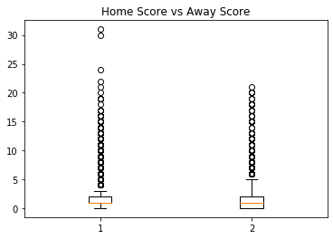
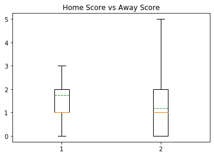
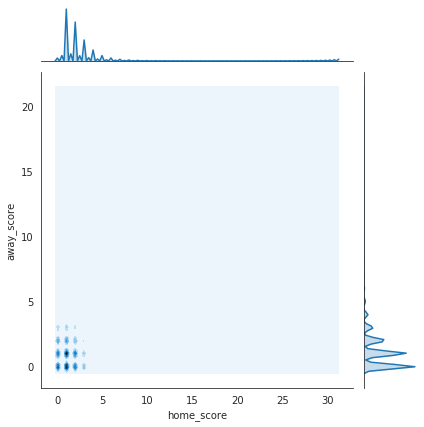

```python
import pandas as pd
import matplotlib.pyplot as plt
import numpy as np
import seaborn as sns
from scipy.stats import poisson,skellam
results = pd.read_csv('/Users/aldiyar/Desktop/python app1/ml/Untitled Folder/results.csv')
```


```python
results.head(5)
```


<div>
<style scoped>
    .dataframe tbody tr th:only-of-type {
        vertical-align: middle;
    }

    .dataframe tbody tr th {
        vertical-align: top;
    }

    .dataframe thead th {
        text-align: right;
    }
</style>
<table border="1" class="dataframe">
  <thead>
    <tr style="text-align: right;">
      <th></th>
      <th>date</th>
      <th>home_team</th>
      <th>away_team</th>
      <th>home_score</th>
      <th>away_score</th>
      <th>tournament</th>
      <th>city</th>
      <th>country</th>
      <th>neutral</th>
    </tr>
  </thead>
  <tbody>
    <tr>
      <td>0</td>
      <td>1872-11-30</td>
      <td>Scotland</td>
      <td>England</td>
      <td>0</td>
      <td>0</td>
      <td>Friendly</td>
      <td>Glasgow</td>
      <td>Scotland</td>
      <td>False</td>
    </tr>
    <tr>
      <td>1</td>
      <td>1873-03-08</td>
      <td>England</td>
      <td>Scotland</td>
      <td>4</td>
      <td>2</td>
      <td>Friendly</td>
      <td>London</td>
      <td>England</td>
      <td>False</td>
    </tr>
    <tr>
      <td>2</td>
      <td>1874-03-07</td>
      <td>Scotland</td>
      <td>England</td>
      <td>2</td>
      <td>1</td>
      <td>Friendly</td>
      <td>Glasgow</td>
      <td>Scotland</td>
      <td>False</td>
    </tr>
    <tr>
      <td>3</td>
      <td>1875-03-06</td>
      <td>England</td>
      <td>Scotland</td>
      <td>2</td>
      <td>2</td>
      <td>Friendly</td>
      <td>London</td>
      <td>England</td>
      <td>False</td>
    </tr>
    <tr>
      <td>4</td>
      <td>1876-03-04</td>
      <td>Scotland</td>
      <td>England</td>
      <td>3</td>
      <td>0</td>
      <td>Friendly</td>
      <td>Glasgow</td>
      <td>Scotland</td>
      <td>False</td>
    </tr>
  </tbody>
</table>
</div>


```python
# New date variables
results['date'] = pd.to_datetime(results['date'])
results['date1_year'] = results['date'].dt.year
results['date2_month'] = results['date'].dt.month
results['date3_day'] = results['date'].dt.day
# Total score is used to compute average score by game
results['total_score'] = results.home_score + results.away_score  
results['diff_score'] = abs(results.home_score - results.away_score)

results.head(5)
```


<div>
<style scoped>
    .dataframe tbody tr th:only-of-type {
        vertical-align: middle;
    }

    .dataframe tbody tr th {
        vertical-align: top;
    }

    .dataframe thead th {
        text-align: right;
    }
</style>
<table border="1" class="dataframe">
  <thead>
    <tr style="text-align: right;">
      <th></th>
      <th>date</th>
      <th>home_team</th>
      <th>away_team</th>
      <th>home_score</th>
      <th>away_score</th>
      <th>tournament</th>
      <th>city</th>
      <th>country</th>
      <th>neutral</th>
      <th>date1_year</th>
      <th>date2_month</th>
      <th>date3_day</th>
      <th>total_score</th>
      <th>diff_score</th>
    </tr>
  </thead>
  <tbody>
    <tr>
      <td>0</td>
      <td>1872-11-30</td>
      <td>Scotland</td>
      <td>England</td>
      <td>0</td>
      <td>0</td>
      <td>Friendly</td>
      <td>Glasgow</td>
      <td>Scotland</td>
      <td>False</td>
      <td>1872</td>
      <td>11</td>
      <td>30</td>
      <td>0</td>
      <td>0</td>
    </tr>
    <tr>
      <td>1</td>
      <td>1873-03-08</td>
      <td>England</td>
      <td>Scotland</td>
      <td>4</td>
      <td>2</td>
      <td>Friendly</td>
      <td>London</td>
      <td>England</td>
      <td>False</td>
      <td>1873</td>
      <td>3</td>
      <td>8</td>
      <td>6</td>
      <td>2</td>
    </tr>
    <tr>
      <td>2</td>
      <td>1874-03-07</td>
      <td>Scotland</td>
      <td>England</td>
      <td>2</td>
      <td>1</td>
      <td>Friendly</td>
      <td>Glasgow</td>
      <td>Scotland</td>
      <td>False</td>
      <td>1874</td>
      <td>3</td>
      <td>7</td>
      <td>3</td>
      <td>1</td>
    </tr>
    <tr>
      <td>3</td>
      <td>1875-03-06</td>
      <td>England</td>
      <td>Scotland</td>
      <td>2</td>
      <td>2</td>
      <td>Friendly</td>
      <td>London</td>
      <td>England</td>
      <td>False</td>
      <td>1875</td>
      <td>3</td>
      <td>6</td>
      <td>4</td>
      <td>0</td>
    </tr>
    <tr>
      <td>4</td>
      <td>1876-03-04</td>
      <td>Scotland</td>
      <td>England</td>
      <td>3</td>
      <td>0</td>
      <td>Friendly</td>
      <td>Glasgow</td>
      <td>Scotland</td>
      <td>False</td>
      <td>1876</td>
      <td>3</td>
      <td>4</td>
      <td>3</td>
      <td>3</td>
    </tr>
  </tbody>
</table>
</div>


```python
results.tail(5)
```


<div>
<style scoped>
    .dataframe tbody tr th:only-of-type {
        vertical-align: middle;
    }

    .dataframe tbody tr th {
        vertical-align: top;
    }

    .dataframe thead th {
        text-align: right;
    }
</style>
<table border="1" class="dataframe">
  <thead>
    <tr style="text-align: right;">
      <th></th>
      <th>date</th>
      <th>home_team</th>
      <th>away_team</th>
      <th>home_score</th>
      <th>away_score</th>
      <th>tournament</th>
      <th>city</th>
      <th>country</th>
      <th>neutral</th>
      <th>date1_year</th>
      <th>date2_month</th>
      <th>date3_day</th>
      <th>total_score</th>
      <th>diff_score</th>
    </tr>
  </thead>
  <tbody>
    <tr>
      <td>41238</td>
      <td>2019-10-20</td>
      <td>Lesotho</td>
      <td>Zimbabwe</td>
      <td>0</td>
      <td>0</td>
      <td>African Nations Championship qualifying</td>
      <td>Lesotho</td>
      <td>Lesotho</td>
      <td>False</td>
      <td>2019</td>
      <td>10</td>
      <td>20</td>
      <td>0</td>
      <td>0</td>
    </tr>
    <tr>
      <td>41239</td>
      <td>2019-10-20</td>
      <td>Guinea</td>
      <td>Senegal</td>
      <td>1</td>
      <td>0</td>
      <td>African Nations Championship qualifying</td>
      <td>Conakry</td>
      <td>Guinea</td>
      <td>False</td>
      <td>2019</td>
      <td>10</td>
      <td>20</td>
      <td>1</td>
      <td>1</td>
    </tr>
    <tr>
      <td>41240</td>
      <td>2019-10-20</td>
      <td>Mali</td>
      <td>Mauritania</td>
      <td>2</td>
      <td>0</td>
      <td>African Nations Championship qualifying</td>
      <td>Mali</td>
      <td>Mali</td>
      <td>False</td>
      <td>2019</td>
      <td>10</td>
      <td>20</td>
      <td>2</td>
      <td>2</td>
    </tr>
    <tr>
      <td>41241</td>
      <td>2019-10-20</td>
      <td>Burkina Faso</td>
      <td>Ghana</td>
      <td>0</td>
      <td>0</td>
      <td>African Nations Championship qualifying</td>
      <td>Burkina Faso</td>
      <td>Burkina Faso</td>
      <td>False</td>
      <td>2019</td>
      <td>10</td>
      <td>20</td>
      <td>0</td>
      <td>0</td>
    </tr>
    <tr>
      <td>41242</td>
      <td>2019-10-20</td>
      <td>Ivory Coast</td>
      <td>Niger</td>
      <td>1</td>
      <td>0</td>
      <td>African Nations Championship qualifying</td>
      <td>Ivory Coast</td>
      <td>Ivory Coast</td>
      <td>False</td>
      <td>2019</td>
      <td>10</td>
      <td>20</td>
      <td>1</td>
      <td>1</td>
    </tr>
  </tbody>
</table>
</div>


```python
results.dtypes
```


    date          object
    home_team     object
    away_team     object
    home_score     int64
    away_score     int64
    tournament    object
    city          object
    country       object
    neutral         bool
    dtype: object


```python
results[['home_score']].describe()
```


<div>
<style scoped>
    .dataframe tbody tr th:only-of-type {
        vertical-align: middle;
    }

    .dataframe tbody tr th {
        vertical-align: top;
    }

    .dataframe thead th {
        text-align: right;
    }
</style>
<table border="1" class="dataframe">
  <thead>
    <tr style="text-align: right;">
      <th></th>
      <th>home_score</th>
    </tr>
  </thead>
  <tbody>
    <tr>
      <td>count</td>
      <td>41243.000000</td>
    </tr>
    <tr>
      <td>mean</td>
      <td>1.744975</td>
    </tr>
    <tr>
      <td>std</td>
      <td>1.750513</td>
    </tr>
    <tr>
      <td>min</td>
      <td>0.000000</td>
    </tr>
    <tr>
      <td>25%</td>
      <td>1.000000</td>
    </tr>
    <tr>
      <td>50%</td>
      <td>1.000000</td>
    </tr>
    <tr>
      <td>75%</td>
      <td>2.000000</td>
    </tr>
    <tr>
      <td>max</td>
      <td>31.000000</td>
    </tr>
  </tbody>
</table>
</div>


```python
results[['away_score']].describe()
```


<div>
<style scoped>
    .dataframe tbody tr th:only-of-type {
        vertical-align: middle;
    }

    .dataframe tbody tr th {
        vertical-align: top;
    }

    .dataframe thead th {
        text-align: right;
    }
</style>
<table border="1" class="dataframe">
  <thead>
    <tr style="text-align: right;">
      <th></th>
      <th>away_score</th>
    </tr>
  </thead>
  <tbody>
    <tr>
      <td>count</td>
      <td>41243.000000</td>
    </tr>
    <tr>
      <td>mean</td>
      <td>1.189317</td>
    </tr>
    <tr>
      <td>std</td>
      <td>1.406648</td>
    </tr>
    <tr>
      <td>min</td>
      <td>0.000000</td>
    </tr>
    <tr>
      <td>25%</td>
      <td>0.000000</td>
    </tr>
    <tr>
      <td>50%</td>
      <td>1.000000</td>
    </tr>
    <tr>
      <td>75%</td>
      <td>2.000000</td>
    </tr>
    <tr>
      <td>max</td>
      <td>21.000000</td>
    </tr>
  </tbody>
</table>
</div>


```python
hs = results["home_score"]
aws = results["away_score"]
data = [hs, aws]
fig1, ax1 = plt.subplots()
ax7.set_title('Home Score vs Away Score')
ax7.boxplot(data)

plt.show()
```





```python
data = [hs, aws]
fig2, ax2 = plt.subplots()
ax2.set_title('Home Score vs Away Score')
ax2.boxplot(data, showfliers=False, meanline= True, showmeans= True)
plt.show()
```





```python
joint=pd.concat([hs, aws], axis=1)
```


```python
with sns.axes_style('white'): 
    sns.jointplot("home_score", "away_score", joint, kind='kde')
```





```python

```


```python

```

